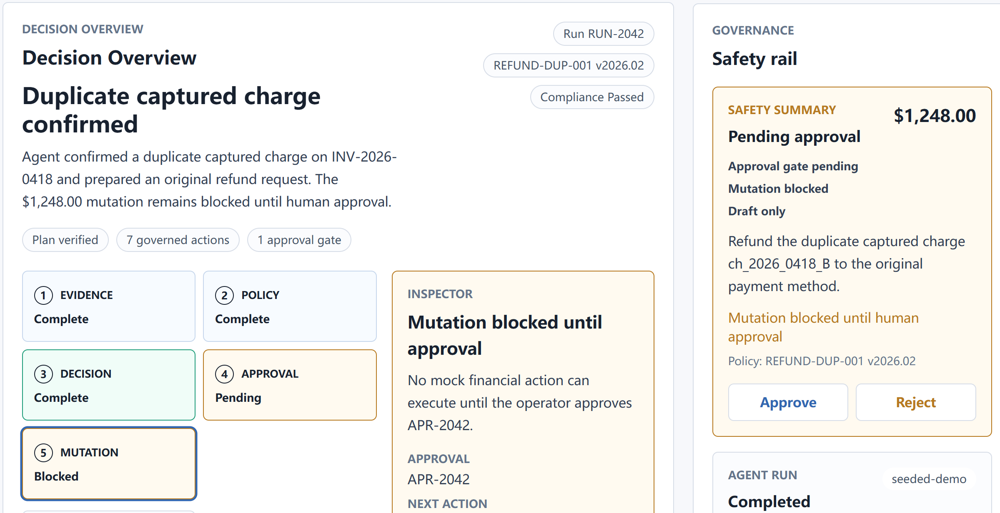
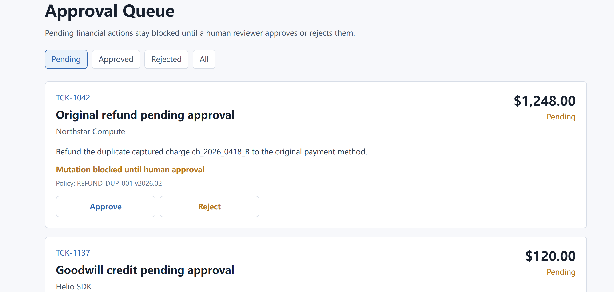
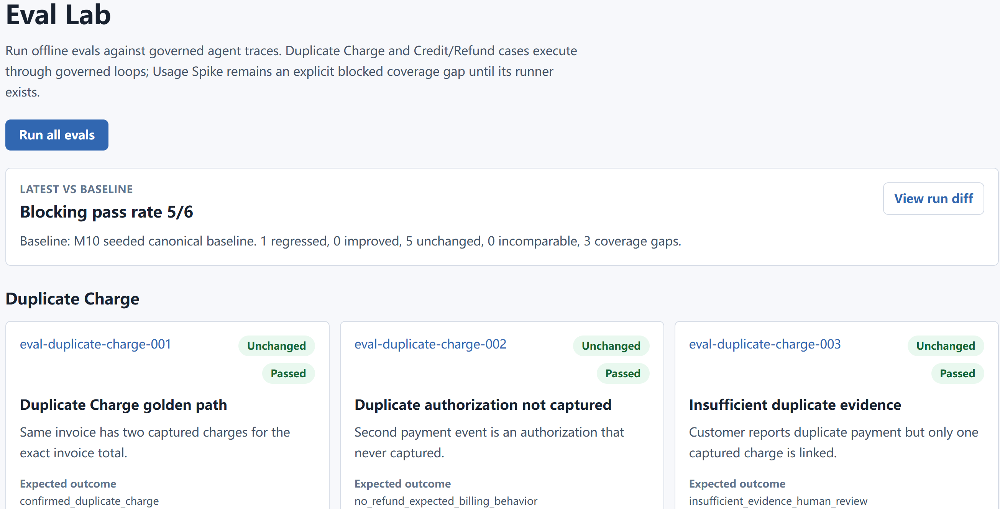
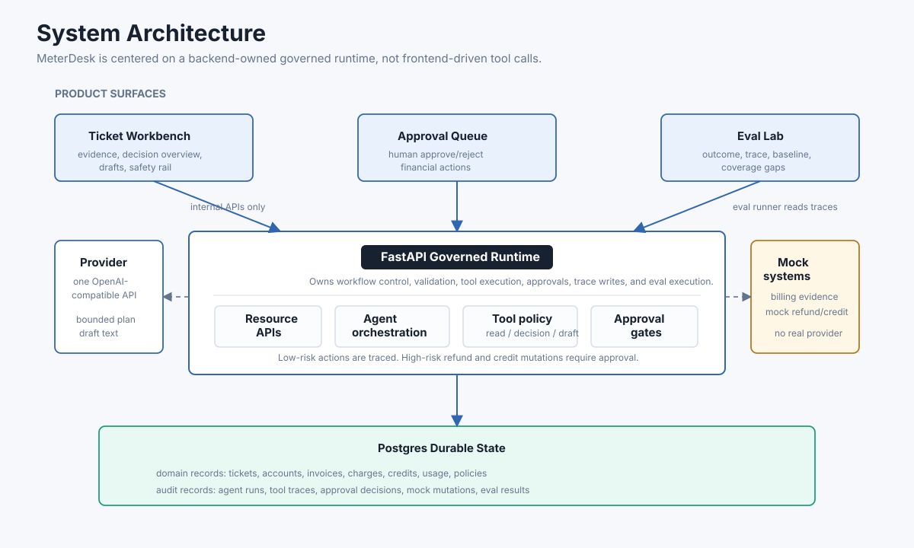
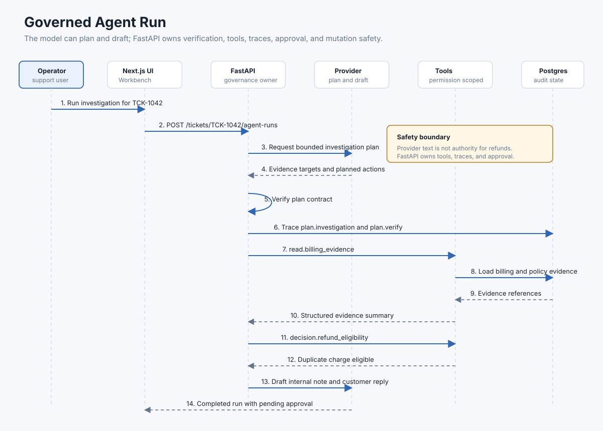
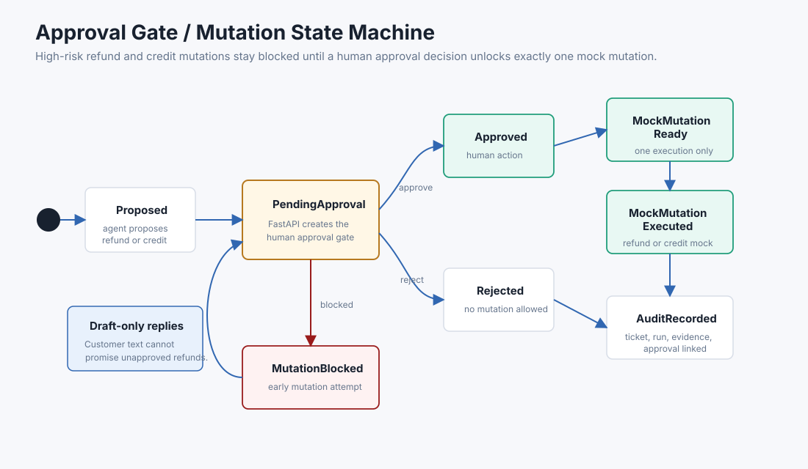

# MeterDesk

MeterDesk is a billing support workbench for usage-based API and AI platforms. An agent investigates each ticket by reading invoices, charges, credits, usage, and policy records through tools owned by the backend.

The product starts from a ticket, not a blank chat box. The agent gathers evidence, explains the billing decision, drafts internal notes and customer-facing text, and asks for approval when money is involved. Refunds and credits execute only after human approval. In v1, those executions are mock mutations.



The Workbench puts the ticket, billing evidence, policy citations, decision path, approval state, and blocked mutation state on the same screen.

## Core capabilities

- Investigations start from a billing dispute ticket instead of an open-ended chat box.
- FastAPI owns the read, decision, draft, approval, and mock mutation boundaries.
- Refund and credit actions stay blocked until a human approves the exact request.
- Agent runs, tool calls, policy citations, approval decisions, and mock mutations are stored for review.
- Eval Lab checks the final answer and the trace path, including evidence coverage and approval routing.

## V1 golden path

The v1 golden path is **Duplicate Charge**:

1. A support operator opens a billing dispute ticket.
2. The agent investigates invoices, charges, account state, credits, usage, and relevant policy.
3. The agent creates a resolution draft with evidence and policy citations.
4. Any refund or credit mutation is routed to human approval.
5. An approved action executes only as a mock mutation.
6. The full run is available as an audit trail and offline eval target.

MeterDesk also includes **Usage Spike** and **Credit/Refund Dispute** as supporting scenarios. Credit/Refund Dispute has a runnable governed workflow for `TCK-1137`. Usage Spike remains a visible coverage gap. Both scenarios reuse the same workbench, trace, approval, and eval model instead of becoming separate product lines.

## Product tour

### Approval Queue

Human reviewers approve or reject pending financial actions. A proposed refund or credit stays blocked until the reviewer records a decision.



### Eval Lab

Eval Lab runs offline checks against governed agent traces, including outcome correctness, required evidence, policy compliance, approval routing, and known coverage gaps.



## System architecture

The app keeps the UI, backend workflow control, agent orchestration, mock systems, and stored audit data behind separate boundaries.



Mermaid reference: [system-architecture.mmd](docs/diagrams/system-architecture.mmd)

Stack:

- Frontend: Next.js
- Backend: FastAPI
- Database: Postgres
- LLM: OpenAI-compatible interface with one live provider in v1
- Retrieval: no vector search in v1; policy uses explicit policy text and eligibility checks
- MCP: adapter-ready tool layer; no required MCP server in v1

## Governed agent run

The model can plan and draft. FastAPI verifies plans, owns tool execution, records traces, and creates approval requests.



Mermaid reference: [governed-agent-run.mmd](docs/diagrams/governed-agent-run.mmd)

## Approval gate state machine

Refunds and credits count as high-risk actions even in a mock system. The agent can propose them, but the mutation stays blocked until a human records an approval decision.



Mermaid reference: [approval-gate-state-machine.mmd](docs/diagrams/approval-gate-state-machine.mmd)

## Local setup

### Prerequisites

- Node.js and npm.
- Python 3.12.
- `uv` for Python dependency management.
- Docker with Compose support for local Postgres.

### First run

```bash
cp .env.example .env
make install
make db-up
make dev
```

The default local services are:

- Frontend: `http://localhost:3000`
- Backend API: `http://localhost:8000`
- Postgres: `localhost:5432`

The frontend reads health status and governed agent resources from FastAPI.

### Development commands

```bash
make install
make db-up
make dev
make dev-api
make dev-web
make health
make test
make test-db
make lint
make seed
make demo-reset-live
make demo-reset-live TICKET_ID=TCK-1137
make db-down
```

`make seed` runs migrations and rebuilds the demo-owned mock billing rows. It leaves unrelated local rows alone. The seed includes Duplicate Charge, Usage Spike, Credit/Refund Dispute, eval fixtures, historical eval mock mutation data, and completed demo baselines for Duplicate Charge and Credit/Refund. Both visible baselines stop at pending approval, with no visible mock mutation before approval.

`make demo-reset-live` clears only `TCK-1042` runtime state by default so a configured OpenAI-compatible provider can run the live Duplicate Charge agent path from the Workbench. Use `make demo-reset-live TICKET_ID=TCK-1137` to reset the Credit/Refund Dispute path.

`make test-db` starts local Postgres, runs migrations, seeds demo data, and checks the M3 seed and run-preflight APIs against the real database. The default `make test` stays fast and does not require Docker/Postgres.

To run the M3 agent loop locally, configure `OPENAI_API_KEY` and `OPENAI_MODEL` in `.env`. `OPENAI_BASE_URL` defaults to `https://api.openai.com/v1` and can point at another OpenAI-compatible endpoint.

### Health checks

```bash
curl --fail http://localhost:8000/health
curl --fail http://localhost:8000/health/db
```

`/health` verifies FastAPI liveness. `/health/db` verifies the backend can execute a simple Postgres query.

If `/health/db` returns 503 while Postgres appears healthy in Docker, see [WSL2 Docker Desktop Postgres troubleshooting](docs/troubleshooting/wsl-docker-postgres-health-db.md).

### Seeded container demo

The host-development workflow above remains the recommended path for local changes. To run the
complete seeded demo in containers instead, use:

```bash
make container-build
make container-up
make container-smoke
make container-down
```

The default container URLs are the same: Web at `http://localhost:3000`, API at
`http://localhost:8000`, and Postgres at `localhost:5432`. The seeded runtime works without a
provider key; its histories are a deterministic replay, not a live agent run. See the
[Container Demo Runbook](docs/runbooks/container-demo.md) for reset behavior, live-provider setup,
health checks, logs, port overrides, and cleanup guidance.

## Guided walkthrough

See [MeterDesk Demo Walkthrough](intv/meterdesk-demo-walkthrough.md) for the no-key seeded baseline, live provider reset path, architecture talking points, and interview notes.

## Further reading

Start with the [documentation index](docs/README.md), which separates current requirements, the
active hardening roadmap, engineering evidence, and historical milestone context.

Current sources:

- [AGENTS.md](AGENTS.md) - operating rules for AI coding agents
- [Product Scope](docs/specs/product-scope.md) - product thesis, v1 scope, golden path, and exclusions
- [System Architecture](docs/specs/system-architecture.md) - application boundaries, data flow, mock systems, and domain glossary
- [Agent Governance](docs/specs/agent-governance.md) - tool governance, approval gates, trace rules, and policy citation requirements
- [Eval Strategy](docs/specs/eval-strategy.md) - offline eval cases, grading dimensions, and Eval Lab expectations
- [Implementation Roadmap](docs/specs/implementation-roadmap.md) - completed v1 program and current phase
- [Post-M10 Hardening Roadmap](docs/specs/hardening/roadmap.md) - active workstreams, dependencies, gates, and re-review points
- [P0-01 CI and Runtime Baseline](docs/specs/hardening/p0-01-ci-runtime-baseline.md) - approved first hardening workstream; implementation not started
- [Engineering Evidence Matrix](docs/evidence/engineering-evidence-matrix.md) - current claims, gaps, planned evidence, and verification rules

Historical context:

- [M0-M10 milestone archive](docs/archive/README.md) - implementation-era design records that no longer define current requirements
- [2026-07-30 ChatGPT hardening handoff](docs/archive/handoffs/2026-07-30-chatgpt/ARCHIVE-NOTICE.md) - preserved source material; archived plans are stale

## Out of scope for v1

- Real payment provider integrations.
- Real Zendesk, Slack, Feishu, or enterprise messaging integrations.
- Automatic customer replies.
- Complex workflow builders.
- A standalone tool registry editor.
- Required MCP server implementation.
- pgvector or large-scale RAG.
- Multi-provider model gateway.
- Enterprise multi-tenant permission systems.
- Security incident or SLA incident workflows.
