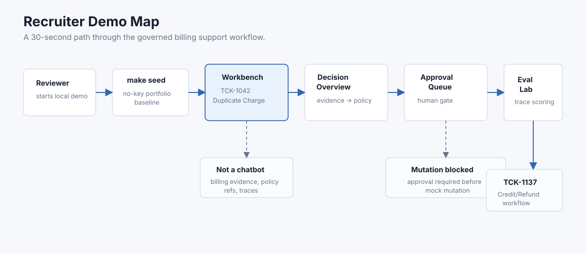

# MeterDesk 面试演示讲稿

这份文档是 MeterDesk 的面试演示脚本。它回答三个问题：要运行什么、要展示什么、以及面试官追问设计时该怎么解释。

## 30 秒项目介绍

MeterDesk 是一个面向 usage-based API / AI 平台的账单支持工作台。它不是客服聊天机器人，而是一个 governed agent product：agent 通过受控工具读取 invoice、charge、credit、usage 和 policy evidence，生成可解释的 resolution draft；一旦涉及 refund 或 credit mutation，系统必须先创建人工审批请求，approval 前不会执行任何 mutation。这个项目的重点是把 agent workflow、权限边界、audit trace、approval gate 和 offline eval 串成一个能演示、能测试、能解释的完整产品切片。

## 演示结构

MeterDesk 是一个面向按量计费 API / AI 平台的账单支持控制台。它的重点不是聊天，而是让 agent（智能体）在受控工具、审计 trace 和人工审批门后处理账单争议。

v1 的主路径是 Duplicate Charge。

演示分两层：

- **无 key 基线**：`make seed` 会加载一条已经完成的 Duplicate Charge 样例。即使没有 OpenAI-compatible provider key，也能看完整的产品路径。
- **真实 provider 路径**：`make demo-reset-live` 默认只清空 Duplicate Charge 主票据的运行态数据；也可以用 `TICKET_ID=TCK-1137` 清空 Credit/Refund Dispute。配置 provider 后，可以在 Workbench 里跑真实 governed agent loop。

无 key 基线不是“无 key 也真实跑 agent”。它是一条 seeded audit trail，用来稳定展示产品流程、治理模型和审批门。真实模型调用仍然走真实 provider 路径。

## README 图示讲法

README 保持普通开源项目入口：介绍产品、能力、架构、运行方式和规格文档。求职导向的讲法放在这份 `intv/` 文档里。



如果对方只给 30 秒，按这条路径讲：

1. Open `http://localhost:3000` and inspect `TCK-1042`, the Duplicate Charge golden path.
2. Review the Decision Overview: evidence -> policy -> decision -> approval -> mutation state.
3. Open `http://localhost:3000/approvals` and approve or reject the proposed financial action.
4. Open `http://localhost:3000/eval-lab` and inspect deterministic eval results plus Usage Spike blocked gaps.
5. Open `http://localhost:3000/?ticket=TCK-1137` to see the supporting Credit/Refund Dispute workflow reuse the same governance path.

仓库里的 SVG 图不是产品功能扩展，而是解释入口。每张图在 `docs/diagrams/` 下都有对应 Mermaid reference，方便后续维护。可以按这个顺序讲：

1. **Recruiter Demo Map**：这张图回答“我应该先看哪里”。从 `make seed` 进入 Ticket Workbench，看 Duplicate Charge 的 Decision Overview，再去 Approval Queue 验证人工审批门，最后去 Eval Lab 看 outcome 和 trace scoring。`TCK-1137` 证明同一套治理路径能复用到 Credit/Refund Dispute；Usage Spike blocked gap 则说明 eval 没有隐藏未完成覆盖。
2. **System Architecture**：这张图强调边界。Next.js 只负责展示和交互；FastAPI 控制 workflow、tool execution、approval 和 eval；Postgres 保存 domain data 和 audit state；provider boundary 很窄，只接一个 OpenAI-compatible provider；外部账单和支付系统都是 mock-only。
3. **Governed Agent Run**：这张 sequence diagram 说明 agent 不是自由调用工具。provider 先给 bounded investigation plan，FastAPI 做 plan verification，然后工具读取证据、执行 deterministic decision，最后只让 provider 生成 draft text。每一步都会写 trace。
4. **Approval Gate State Machine**：这张图是安全模型。Agent 可以 propose refund 或 credit，但进入 `PendingApproval` 后 mutation tool 仍然 blocked。只有 human approve 后，系统才允许一次 mock mutation；reject 则进入 no-mutation closed state。

## 首次启动

```bash
cp .env.example .env
make install
make db-up
make seed
make dev
```

打开这些页面：

- Workbench: `http://localhost:3000`
- Approval Queue: `http://localhost:3000/approvals`
- Eval Lab: `http://localhost:3000/eval-lab`

后端 API 在 `http://localhost:8000`。

## 基线演示流程

先打开 `TCK-1042` 的 Ticket Workbench。

按这个顺序讲：

1. **票据优先的调查入口**：入口是一张 billing dispute ticket，不是一个泛用聊天框。
2. **Decision Overview**：先看结论，再看 evidence、policy、decision、approval 和 mutation state 串起来的解释链路。
3. **账单证据**：invoice `INV-2026-0418` 下面有两笔 captured charges，金额都等于 invoice total。
4. **Blocked mutation**：默认选中的节点是 `Mutation blocked`。这里说明 refund proposal 已经生成，但 approval 还是 pending，所以不会产生 mock mutation。
5. **策略依据**：duplicate charge decision 引用了 `REFUND-DUP-001 v2026.02`，policy refs 和 trace ids 可以在 graph inspector 里看到。
6. **只生成草稿**：customer reply 是 Decision 的 side output，标记为 draft only，MeterDesk 不会自动发送给客户。
7. **可追溯性**：Safety rail 保留 Trace diagnostics，可以展开看 agent run、evidence read、prior-action check、decision、draft creation 和 approval request。

然后打开 Approval Queue：

1. Pending approval 不只在 Workbench 里可见，也进入了集中审批队列。
2. Approve / reject 都是人工动作。
3. Approve 最多创建一次 mock mutation；reject 不会创建 mutation。

再打开 Eval Lab：

1. Duplicate Charge cases 是当前可执行的 golden-path eval。
2. Credit/Refund Dispute cases 也会通过 governed workflow 跑出 trace、approval 和 deterministic checks。
3. Usage Spike 仍然显示为 `blocked` coverage gap。Eval Lab 应该诚实展示当前覆盖范围，而不是把没实现的 workflow runner 藏起来。

然后打开 `http://localhost:3000/?ticket=TCK-1137`：

1. 这是 supporting scenario，不是新的产品线。
2. Agent 读取 trial credit、subscription/cancellation timing、prior adjustment 和 policy refs。
3. Deterministic decision tool 计算剩余 disputed trial credit，而不是让 LLM 自己决定金额。
4. Decision Overview 复用同一套 evidence -> policy -> decision -> approval -> mutation 解释链路。
5. `goodwill_credit` 会进入 pending approval；approval 前没有 mock mutation。

## 真实 Provider 路径

在 `.env` 里配置 provider：

```bash
OPENAI_API_KEY=...
OPENAI_MODEL=...
OPENAI_BASE_URL=https://api.openai.com/v1
```

只重置 live demo 主票据的运行态数据：

```bash
make demo-reset-live
# or
make demo-reset-live TICKET_ID=TCK-1137
```

刷新 Workbench。对应 ticket 应该回到 no-run 状态：没有 agent run、没有 approval、没有 trace entries，也没有 mock mutation。Billing evidence 和 policies 会保留。

点击 **Run investigation**。一次成功的 live run 应该：

- 创建 completed agent run。
- 写入 tool traces。
- 生成 internal resolution draft 和 customer-facing draft。
- 创建 pending approval request。
- 在 approval 前不创建任何 mock mutation。

如果 provider 没配置，API 会在创建 run 之前返回 `503`。这是预期行为。它保证无 key 基线和真实模型执行之间的边界清楚。

## Eval 讲法

MeterDesk 的 eval 是离线 eval，重点是治理行为，不是单纯比较一句回答好不好。

它检查 agent 是否：

- 得到预期 outcome。
- 收集必要 evidence。
- 引用正确 policy。
- 把 financial action 送进 approval。
- 在 approval 前避免 mutation。
- 生成安全的 draft text。

Deterministic checks 是主要信号。LLM-as-judge 只用于 draft quality，而且是 advisory，不会覆盖 deterministic pass/fail。

Usage Spike 的 blocked cases 不是 Duplicate Charge 或 Credit/Refund 路径的失败。它们是刻意列出来的 coverage gaps，说明 eval system 没有把尚未实现的 runner 藏起来。

## 架构讲法

- **FastAPI 控制工作流**：frontend 不能直接调用 tools。
- **Decision tool 是 outcome authority**：provider 只负责 draft text，不决定 refund eligibility 或 amount。
- **Provider boundary 很窄**：v1 只接一个 OpenAI-compatible provider，不做 multi-provider gateway。
- **Approval gate 控制高风险动作**：refund / credit mutation 必须经过人工审批。
- **外部系统全是 mock-only**：没有真实 Stripe、support、Slack 或 email integration。
- **Decision Overview 是产品解释层**：它把底层 trace 转成 evidence -> policy -> decision -> approval -> mutation 的可读链路。
- **Safety rail 是治理操作层**：它集中展示 run、compliance、approval、mock mutation、draft 和 trace diagnostics。
- **Trace 是审计数据**：Trace diagnostics 仍然解释 agent 看了什么、判断了什么、写了什么、把什么送去审批。

## 面试常见追问

### 为什么要 seed 一条 completed run？

因为作品集演示需要一个可靠基线。Reviewer 应该可以在不配置 provider key、不等待网络调用的情况下看懂产品。真实 provider 路径没有被移除，通过 `make demo-reset-live` 进入。

### 为什么不加 mock provider mode？

M5 不想新增第二种运行模式。Seeded data 明确是 demo baseline；真实执行仍然走 live provider boundary。这样边界更容易解释，也少一个测试面。

### 为什么 Usage Spike eval cases 是 blocked？

因为 Usage Spike 是计划内覆盖，但 runner 还没有实现。Duplicate Charge 是 v1 golden path，Credit/Refund 是第二条 supporting governed workflow。把 Usage Spike blocked cases 留在 Eval Lab 里，能说明 eval system 没有把缺口藏起来。

### 什么机制阻止未授权退款？

Decision tool 可以提出 refund，但 FastAPI 创建的是 approval request，不是 mutation。只有 approved approval request 才能创建一个 mock mutation。Rejected request 不会创建 mutation。

### 下一步会做什么？

下一步不应该先堆 UI 装饰。更有价值的方向有两个：实现 Usage Spike runner，或者把 tool boundary 扩展成更明确的 policy / eligibility engine，同时保留 approval 和 trace 约束。
